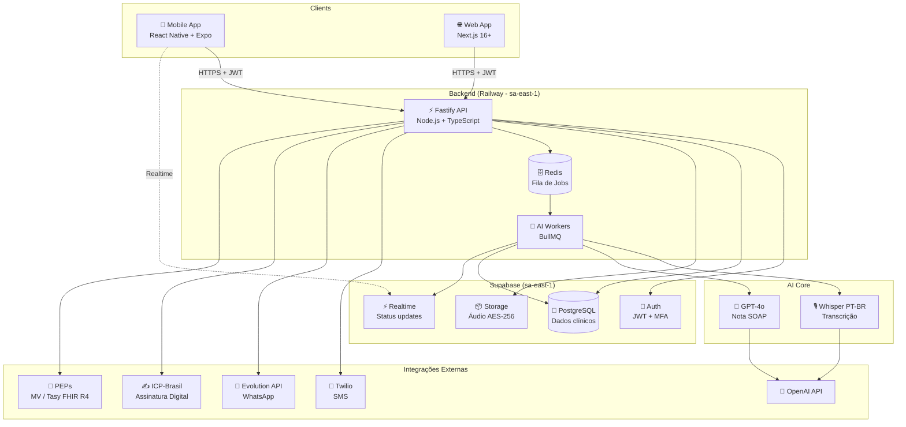
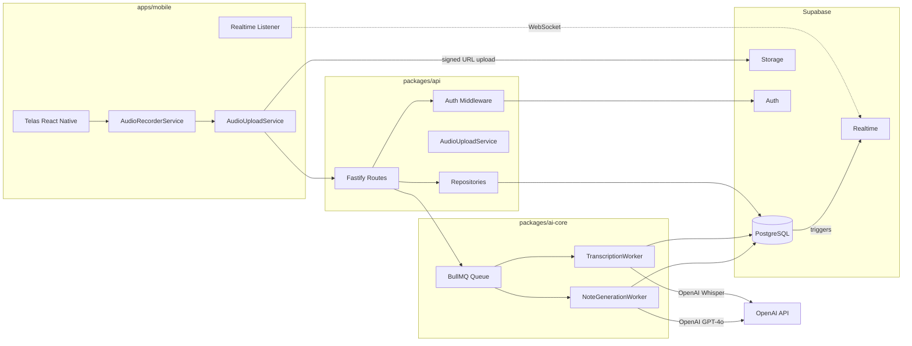
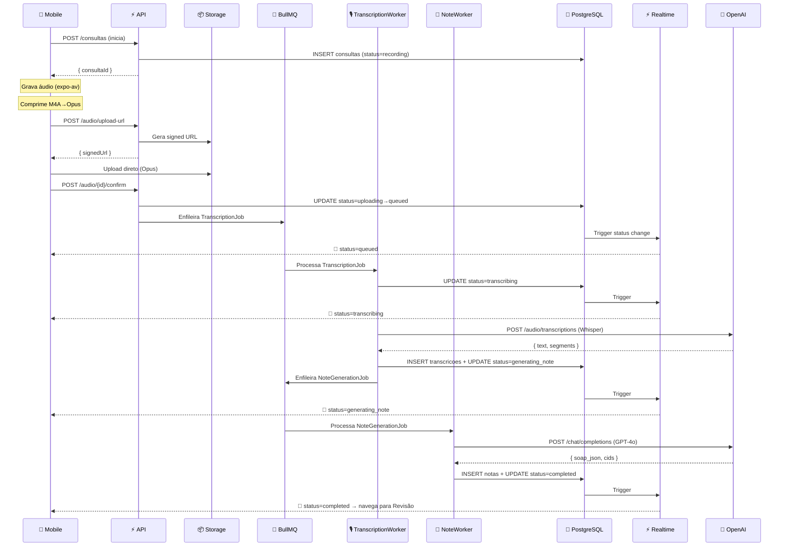
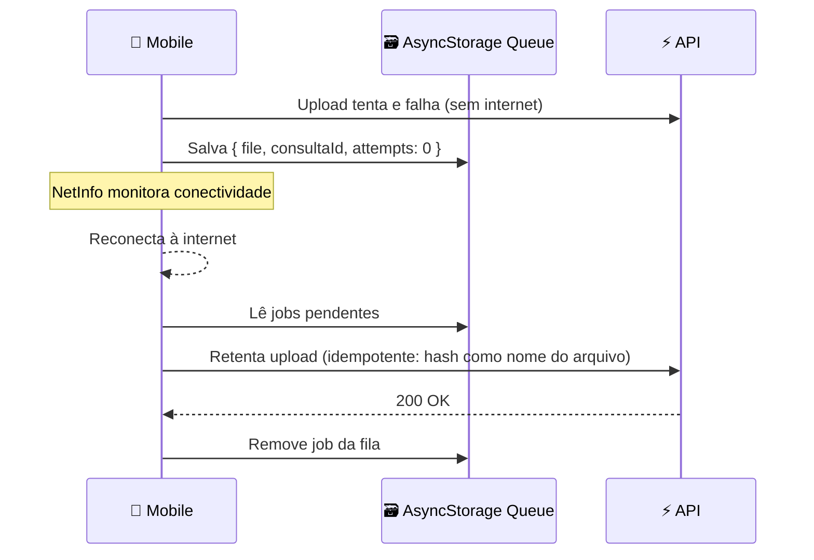

# AI Scribe PT-BR — Fullstack Architecture Document

> **Versão:** 1.0 | **Status:** Draft | **Autor:** Aria (@architect) | **Data:** 2026-04-12

---

## Change Log

| Date | Version | Description | Author |
|------|---------|-------------|--------|
| 2026-04-12 | 1.0 | Arquitetura inicial — baseada no PRD v0.1 | Aria (@architect) |

---

## 1. Introduction

### 1.1 Starter Template / Projeto Base

**N/A — Greenfield project.**

O projeto parte do zero usando Turborepo como monorepo manager, com os pacotes definidos no PRD. Nenhuma restrição de template existente.

### 1.2 Visão Geral

Este documento define a arquitetura fullstack completa do **AI Scribe PT-BR** — um assistente de documentação clínica baseado em IA para médicos brasileiros. Cobre backend, frontend mobile/web, infraestrutura, pipeline de AI e integrações externas.

O sistema é construído como **monolith modular para MVP**, com separação clara de bounded contexts que permite evolução para microservices nas fases pós-MVP (E4–E7). A prioridade é **time-to-market** com conformidade LGPD desde o dia 1.

---

## 2. High-Level Architecture

### 2.1 Technical Summary

AI Scribe PT-BR usa uma arquitetura **Mobile-First + Monolith Modular** com Turborepo. O app mobile (React Native + Expo) é o canal primário; a web (Next.js) é canal secundário de revisão/admin. O backend é um único processo Fastify com módulos bem definidos (auth, audio, transcription, notes, integrations). A camada de AI é isolada em `packages/ai-core` com workers BullMQ assíncronos para processamento pesado (Whisper + GPT-4o). O banco é PostgreSQL via Supabase na região `sa-east-1` (conformidade LGPD). A plataforma de deploy primária é Railway (backend) + Vercel (web) + EAS (mobile).

### 2.2 Platform and Infrastructure

**Plataforma selecionada: Supabase + Railway + Vercel + EAS**

| Componente | Plataforma | Região | Rationale |
|-----------|-----------|--------|-----------|
| Banco de Dados | Supabase (PostgreSQL) | `sa-east-1` (São Paulo) | LGPD compliance, Auth built-in, RLS nativo, Storage integrado |
| Backend API | Railway | São Paulo | Deploy simples, auto-scaling, suporte a workers BullMQ |
| Redis (fila) | Railway (Redis add-on) | São Paulo | Co-localizado com backend, latência mínima |
| Web Frontend | Vercel | Global Edge | Next.js optimizado, CI/CD automático via GitHub |
| Mobile | EAS (Expo Application Services) | — | Build nativo iOS/Android, OTA updates |
| Storage (áudio) | Supabase Storage | `sa-east-1` | Integrado ao auth, signed URLs, criptografia AES-256 |
| CDN | Vercel Edge | Global | Assets web servidos globalmente |

### 2.3 Repository Structure

**Estrutura:** Monorepo com Turborepo
**Monorepo Tool:** Turborepo v2+
**Package Organization:** Apps separados por canal (mobile, web); packages por domínio (api, ai-core, shared)

### 2.4 High-Level Architecture Diagram



### 2.5 Architectural Patterns

- **Monolith Modular:** Backend único com bounded contexts (auth, audio, transcription, notes, integrations) — _Rationale:_ Reduz complexidade operacional no MVP sem sacrificar separação lógica
- **Event-Driven AI Pipeline:** Workers BullMQ processam áudio → transcrição → nota de forma assíncrona — _Rationale:_ Desacopla latência de AI (60s+) da resposta HTTP; permite retry, prioridade e observabilidade
- **Repository Pattern:** Camada de acesso a dados abstraída via interfaces TypeScript — _Rationale:_ Testabilidade e flexibilidade para migrar queries sem alterar lógica de negócio
- **BFF (Backend for Frontend):** API Fastify serve tanto mobile quanto web com endpoints otimizados — _Rationale:_ Evita over-fetching no mobile; centraliza auth e rate-limiting
- **Offline-First Mobile:** AsyncStorage + fila local de retry no mobile — _Rationale:_ NFR4 — médicos em ambientes com conectividade instável
- **RLS (Row Level Security):** Todas as tabelas Supabase com políticas RLS — _Rationale:_ Conformidade LGPD — médico nunca acessa dados de outro médico

---

## 3. Tech Stack

| Categoria | Tecnologia | Versão | Propósito | Rationale |
|-----------|-----------|--------|-----------|-----------|
| Mobile Language | TypeScript | 5.x | App mobile tipado | Type-safety end-to-end |
| Mobile Framework | React Native + Expo | SDK 52 | App iOS + Android | Shared codebase, EAS builds |
| Mobile Audio | expo-av | 14.x | Gravação de áudio | Ecossistema Expo nativo |
| Mobile Compression | react-native-compressor | 1.x | M4A → Opus pre-upload | Resolve limite 50MB Storage |
| Mobile State | Zustand | 5.x | Estado global | Leve, sem boilerplate |
| Mobile Navigation | Expo Router | 4.x | File-based routing | Padrão Expo moderno |
| Web Framework | Next.js | 16+ | Web app + SSR | App Router, Server Components |
| Web Styling | Tailwind CSS | 4.x | Estilização | Consistência com design system |
| Web State | TanStack Query | 5.x | Server state + cache | Padrão para data fetching |
| Backend Language | TypeScript | 5.x | API tipada | Segurança de tipos |
| Backend Framework | Fastify | 5.x | API REST | Performance, plugins, schema |
| Backend Validation | Zod | 3.x | Input validation | Compartilhado com frontend |
| API Style | REST | — | Endpoints HTTP | Simples, compatível com FHIR |
| Queue | BullMQ | 5.x | Jobs assíncronos | Workers AI, retry, prioridade |
| Cache/Queue Broker | Redis | 7.x | Broker BullMQ | Persistência de jobs |
| Database | PostgreSQL (Supabase) | 15+ | Dados clínicos | LGPD sa-east-1, RLS nativo |
| Auth | Supabase Auth | — | JWT + MFA + OAuth | Integrado ao DB, RLS automático |
| Storage | Supabase Storage | — | Áudio criptografado | AES-256, signed URLs |
| Realtime | Supabase Realtime | — | Status pipeline AI | WebSocket gerenciado |
| AI Transcrição | OpenAI Whisper | v2 | Transcrição PT-BR | Melhor acurácia PT-BR |
| AI Nota | OpenAI GPT-4o | — | Geração nota SOAP | Qualidade clínica |
| SMS | Twilio | — | Notificações SMS | Confiabilidade BR |
| WhatsApp | Evolution API | v2 | WhatsApp Business | API BR para WhatsApp |
| Assinatura Digital | ICP-Brasil / Certisign | — | Assinatura CFM | Requisito regulatório BR |
| Interop | FHIR R4 | — | Integração PEPs | Padrão HL7 internacional |
| Frontend Testing | Jest + RNTL | — | Testes unitários mobile | Padrão React Native |
| Backend Testing | Vitest | 2.x | Testes unitários API | Mais rápido que Jest |
| E2E Testing | Playwright | 1.x | Fluxos críticos web | Padrão E2E moderno |
| Build Tool | Turborepo | 2.x | Monorepo build | Cache incremental |
| CI/CD | GitHub Actions | — | Pipelines automáticos | Integrado ao repo |
| Mobile Deploy | EAS (Expo) | — | Build + OTA | iOS + Android nativo |
| Web Deploy | Vercel | — | Deploy Next.js | Edge network, CI automático |
| Backend Deploy | Railway | — | Deploy API + Workers | Auto-scaling, SA region |
| Monitoring | Sentry | — | Error tracking | Mobile + web + backend |
| Logging | Pino (Fastify) | — | Logs estruturados | JSON, integra Railway logs |
| APM | OpenTelemetry | — | Traces distribuídos | Observabilidade do pipeline AI |

---

## 4. Data Models

### 4.1 Medico

**Purpose:** Representa o profissional médico — entidade central do sistema.

**Key Attributes:**
- `id`: UUID — PK
- `user_id`: UUID — FK para `auth.users` (Supabase)
- `nome`: string — Nome completo
- `crm`: string — CRM + UF (ex: "12345-SP")
- `especialidade`: string — Especialidade médica
- `plano`: enum — `free | basic | pro`
- `configuracoes`: jsonb — Preferências do médico
- `created_at`: timestamptz

```typescript
interface Medico {
  id: string;
  user_id: string;
  nome: string;
  crm: string;
  especialidade: string;
  plano: 'free' | 'basic' | 'pro';
  configuracoes: MedicoConfiguracoes;
  created_at: string;
}
```

**Relationships:**
- 1:N com `Consultas`
- 1:N com `Pacientes`
- 1:N com `Templates`

---

### 4.2 Paciente

**Purpose:** Dados do paciente — identificação mínima para vinculação da consulta. Sem PII excessiva (LGPD).

**Key Attributes:**
- `id`: UUID — PK
- `medico_id`: UUID — FK `medicos.id` (isolamento por médico)
- `nome`: string
- `data_nascimento`: date
- `telefone`: string (opcional, para notificações)
- `created_at`: timestamptz

```typescript
interface Paciente {
  id: string;
  medico_id: string;
  nome: string;
  data_nascimento?: string;
  telefone?: string;
  created_at: string;
}
```

**Relationships:**
- N:1 com `Medico`
- 1:N com `Consultas`

---

### 4.3 Consulta

**Purpose:** Representa uma consulta médica — entidade pivô do pipeline AI Scribe.

**Key Attributes:**
- `id`: UUID — PK
- `medico_id`: UUID — FK
- `paciente_id`: UUID — FK
- `duracao_ms`: integer
- `timestamp_inicio`: timestamptz
- `timestamp_fim`: timestamptz
- `audio_url`: string — Path no Supabase Storage
- `status`: enum — `recording | uploading | queued | transcribing | generating_note | completed | failed`
- `created_at`: timestamptz

```typescript
interface Consulta {
  id: string;
  medico_id: string;
  paciente_id: string;
  duracao_ms: number;
  timestamp_inicio: string;
  timestamp_fim: string;
  audio_url: string;
  status: ConsultaStatus;
  created_at: string;
}

type ConsultaStatus =
  | 'recording'
  | 'uploading'
  | 'queued'
  | 'transcribing'
  | 'generating_note'
  | 'completed'
  | 'failed';
```

**Relationships:**
- N:1 com `Medico`
- N:1 com `Paciente`
- 1:1 com `Transcricao`
- 1:1 com `Nota`

---

### 4.4 Transcricao

**Purpose:** Resultado da transcrição Whisper da consulta.

**Key Attributes:**
- `id`: UUID — PK
- `consulta_id`: UUID — FK único
- `texto_completo`: text
- `segmentos_json`: jsonb — Array de `{start, end, text, speaker}`
- `duracao_ms`: integer
- `status`: enum — `pending | processing | completed | failed`
- `custo_usd`: decimal(10,6)
- `created_at`: timestamptz

```typescript
interface Transcricao {
  id: string;
  consulta_id: string;
  texto_completo: string;
  segmentos_json: TranscricaoSegmento[];
  duracao_ms: number;
  status: 'pending' | 'processing' | 'completed' | 'failed';
  custo_usd: number;
  created_at: string;
}

interface TranscricaoSegmento {
  start: number;
  end: number;
  text: string;
  speaker?: string;
}
```

---

### 4.5 Nota

**Purpose:** Nota clínica SOAP gerada pelo GPT-4o, editável pelo médico.

**Key Attributes:**
- `id`: UUID — PK
- `consulta_id`: UUID — FK único
- `transcricao_id`: UUID — FK
- `soap_json`: jsonb — `{subjetivo, objetivo, avaliacao, plano}`
- `texto_editado`: text — Versão revisada pelo médico
- `cids_sugeridos`: jsonb — Array de CIDs sugeridos
- `status`: enum — `draft | reviewed | approved | exported`
- `versao`: integer
- `assinatura_hash`: string — Hash ICP-Brasil (quando assinado)
- `created_at`: timestamptz

```typescript
interface Nota {
  id: string;
  consulta_id: string;
  transcricao_id: string;
  soap_json: SoapNota;
  texto_editado?: string;
  cids_sugeridos: CidSugestao[];
  status: 'draft' | 'reviewed' | 'approved' | 'exported';
  versao: number;
  assinatura_hash?: string;
  created_at: string;
}

interface SoapNota {
  subjetivo: string;
  objetivo: string;
  avaliacao: string;
  plano: string;
}
```

---

## 5. API Specification

### Base URL
- **Development:** `http://localhost:3001/api/v1`
- **Production:** `https://api.aiscribe.com.br/api/v1`

### Authentication
Todos os endpoints (exceto `/auth/*`) requerem header:
```
Authorization: Bearer <supabase_jwt>
```

### Endpoints por Módulo

```yaml
openapi: 3.0.0
info:
  title: AI Scribe PT-BR API
  version: 1.0.0

paths:
  # Auth
  /auth/register:
    post:
      summary: Registro de médico
      tags: [Auth]

  /auth/login:
    post:
      summary: Login com email/senha
      tags: [Auth]

  # Consultas
  /consultas:
    get:
      summary: Listar consultas do médico autenticado
      tags: [Consultas]
    post:
      summary: Criar nova consulta (inicia pipeline)
      tags: [Consultas]

  /consultas/{id}:
    get:
      summary: Detalhes da consulta com status do pipeline
      tags: [Consultas]
    patch:
      summary: Atualizar consulta (encerrar gravação)
      tags: [Consultas]

  /consultas/{id}/status:
    get:
      summary: Status completo do pipeline (gravação → nota)
      tags: [Consultas]

  # Áudio
  /audio/upload-url:
    post:
      summary: Gerar signed URL para upload direto ao Storage
      tags: [Audio]

  /audio/{consultaId}/confirm:
    post:
      summary: Confirmar upload e enfileirar transcrição
      tags: [Audio]

  # Transcrições
  /transcricoes/{consultaId}:
    get:
      summary: Obter transcrição da consulta
      tags: [Transcricoes]

  # Notas
  /notas/{consultaId}:
    get:
      summary: Obter nota SOAP gerada
      tags: [Notas]
    patch:
      summary: Salvar edições do médico na nota
      tags: [Notas]

  /notas/{consultaId}/approve:
    post:
      summary: Aprovar nota (muda status para approved)
      tags: [Notas]

  /notas/{consultaId}/export/pdf:
    post:
      summary: Exportar nota como PDF com assinatura digital
      tags: [Notas]

  # Pacientes
  /pacientes:
    get:
      summary: Listar pacientes do médico
      tags: [Pacientes]
    post:
      summary: Criar novo paciente
      tags: [Pacientes]

  /pacientes/{id}:
    get:
      summary: Histórico do paciente com consultas anteriores
      tags: [Pacientes]

  # Templates
  /templates:
    get:
      summary: Listar templates do médico
      tags: [Templates]
    post:
      summary: Criar template customizado
      tags: [Templates]

  # Health
  /health:
    get:
      summary: Health check da API
      tags: [System]

  /health/queues:
    get:
      summary: Status das filas BullMQ
      tags: [System]
```

---

## 6. Components

### 6.1 AudioRecorderService (Mobile)

**Responsibility:** Gravar áudio da consulta, gerenciar background session, comprimir e enfileirar upload.

**Key Interfaces:**
- `startRecording(consultaId: string): Promise<void>`
- `stopRecording(): Promise<AudioFile>`
- `getRecordingStatus(): RecordingStatus`

**Dependencies:** expo-av, react-native-compressor, AudioUploadService

**Technology:** TypeScript, expo-av, AsyncStorage (retry queue)

---

### 6.2 AudioUploadService (packages/api)

**Responsibility:** Upload de arquivos de áudio para Supabase Storage via signed URL com retry offline.

**Key Interfaces:**
- `getSignedUploadUrl(consultaId: string): Promise<string>`
- `uploadAudio(url: string, file: AudioFile): Promise<void>`
- `confirmUpload(consultaId: string): Promise<void>`

**Dependencies:** Supabase Storage SDK, AsyncStorage

**Technology:** TypeScript, @supabase/supabase-js

---

### 6.3 TranscriptionWorker (packages/ai-core)

**Responsibility:** Consumer BullMQ que processa jobs de transcrição usando OpenAI Whisper.

**Key Interfaces:**
- `processJob(job: TranscriptionJob): Promise<TranscricaoResult>`
- Chunking automático para arquivos > 25MB via ffmpeg

**Dependencies:** BullMQ, OpenAI SDK, ffmpeg-static

**Technology:** TypeScript, BullMQ Worker, OpenAI Whisper API

---

### 6.4 NoteGenerationWorker (packages/ai-core)

**Responsibility:** Consumer BullMQ que gera notas SOAP a partir da transcrição usando GPT-4o.

**Key Interfaces:**
- `processJob(job: NoteGenerationJob): Promise<Nota>`
- Prompt engineering com template por especialidade médica

**Dependencies:** BullMQ, OpenAI SDK, templates de especialidade

**Technology:** TypeScript, BullMQ Worker, OpenAI GPT-4o

---

### 6.5 Fastify API (packages/api)

**Responsibility:** Servidor HTTP central — auth, roteamento, validação, orquestração de serviços.

**Key Interfaces:** REST endpoints definidos na seção 5

**Dependencies:** Supabase Auth, BullMQ (producer), todos os services

**Technology:** Fastify 5, Zod, @supabase/supabase-js

---

### 6.6 Realtime Status Bridge

**Responsibility:** Propagar atualizações de status do pipeline AI para o mobile via Supabase Realtime.

**Key Interfaces:**
- Workers atualizam `consultas.status` no PostgreSQL
- Mobile assina via `supabase.channel('consulta-{id}')`

**Dependencies:** Supabase Realtime, PostgreSQL triggers

**Technology:** Supabase Realtime (WebSocket gerenciado)

---

### Component Diagram



---

## 7. External APIs

### 7.1 OpenAI API

- **Purpose:** Transcrição (Whisper) e geração de nota SOAP (GPT-4o)
- **Base URL:** `https://api.openai.com/v1`
- **Authentication:** Bearer token (`OPENAI_API_KEY`)
- **Rate Limits:** Tier 2+ recomendado — 1M tokens/min GPT-4o
- **Key Endpoints:**
  - `POST /audio/transcriptions` — Whisper transcription
  - `POST /chat/completions` — GPT-4o note generation
- **Integration Notes:** Chunking obrigatório para áudio > 25MB. Custo por consulta: ~$0.02 Whisper + ~$0.05 GPT-4o.

### 7.2 Supabase

- **Purpose:** Database, Auth, Storage, Realtime
- **Base URL:** `https://{project}.supabase.co`
- **Authentication:** Service role key (backend) + anon key (frontend)
- **Key Features:** RLS policies, signed URLs, WebSocket Realtime

### 7.3 Twilio

- **Purpose:** SMS de lembretes e notificações pós-consulta
- **Base URL:** `https://api.twilio.com/2010-04-01`
- **Authentication:** Account SID + Auth Token
- **Key Endpoints:** `POST /Accounts/{SID}/Messages`

### 7.4 Evolution API (WhatsApp Business)

- **Purpose:** Mensagens WhatsApp para follow-up de pacientes
- **Authentication:** API Key
- **Integration Notes:** Self-hosted ou cloud. Requer número WhatsApp Business homologado.

### 7.5 ICP-Brasil / Certisign

- **Purpose:** Assinatura digital de notas clínicas conforme CFM
- **Authentication:** Certificado digital A1/A3
- **Integration Notes:** Integração em E3 (Review & Approval). Hash SHA-256 da nota + timestamp.

### 7.6 PEPs Brasileiros (FHIR R4)

- **Purpose:** Exportação de notas para MV Saúde e Tasy/Philips
- **Standard:** HL7 FHIR R4
- **Key Resources:** `Composition` (nota), `Patient`, `Encounter`
- **Integration Notes:** Implementação em E5. Cada PEP tem endpoint FHIR próprio.

---

## 8. Core Workflows

### 8.1 Pipeline Principal: Gravação → Nota SOAP



### 8.2 Retry Offline (Mobile)



---

## 9. Database Schema

```sql
-- Extensões
CREATE EXTENSION IF NOT EXISTS "uuid-ossp";

-- Médicos
CREATE TABLE medicos (
  id UUID PRIMARY KEY DEFAULT uuid_generate_v4(),
  user_id UUID REFERENCES auth.users(id) ON DELETE CASCADE,
  nome TEXT NOT NULL,
  crm TEXT NOT NULL UNIQUE,
  especialidade TEXT,
  plano TEXT DEFAULT 'free' CHECK (plano IN ('free', 'basic', 'pro')),
  configuracoes JSONB DEFAULT '{}',
  created_at TIMESTAMPTZ DEFAULT NOW()
);

-- Pacientes
CREATE TABLE pacientes (
  id UUID PRIMARY KEY DEFAULT uuid_generate_v4(),
  medico_id UUID REFERENCES medicos(id) ON DELETE CASCADE,
  nome TEXT NOT NULL,
  data_nascimento DATE,
  telefone TEXT,
  created_at TIMESTAMPTZ DEFAULT NOW()
);

-- Consultas
CREATE TABLE consultas (
  id UUID PRIMARY KEY DEFAULT uuid_generate_v4(),
  medico_id UUID REFERENCES medicos(id) ON DELETE CASCADE,
  paciente_id UUID REFERENCES pacientes(id),
  duracao_ms INTEGER,
  timestamp_inicio TIMESTAMPTZ NOT NULL,
  timestamp_fim TIMESTAMPTZ,
  audio_url TEXT,
  status TEXT DEFAULT 'recording' CHECK (
    status IN ('recording','uploading','queued','transcribing','generating_note','completed','failed')
  ),
  created_at TIMESTAMPTZ DEFAULT NOW()
);

-- Transcrições
CREATE TABLE transcricoes (
  id UUID PRIMARY KEY DEFAULT uuid_generate_v4(),
  consulta_id UUID REFERENCES consultas(id) ON DELETE CASCADE UNIQUE,
  texto_completo TEXT,
  segmentos_json JSONB DEFAULT '[]',
  duracao_ms INTEGER,
  status TEXT DEFAULT 'pending' CHECK (status IN ('pending','processing','completed','failed')),
  custo_usd DECIMAL(10,6),
  created_at TIMESTAMPTZ DEFAULT NOW()
);

-- Notas Clínicas
CREATE TABLE notas (
  id UUID PRIMARY KEY DEFAULT uuid_generate_v4(),
  consulta_id UUID REFERENCES consultas(id) ON DELETE CASCADE UNIQUE,
  transcricao_id UUID REFERENCES transcricoes(id),
  soap_json JSONB NOT NULL DEFAULT '{}',
  texto_editado TEXT,
  cids_sugeridos JSONB DEFAULT '[]',
  status TEXT DEFAULT 'draft' CHECK (status IN ('draft','reviewed','approved','exported')),
  versao INTEGER DEFAULT 1,
  assinatura_hash TEXT,
  created_at TIMESTAMPTZ DEFAULT NOW()
);

-- Templates de Especialidade
CREATE TABLE templates (
  id UUID PRIMARY KEY DEFAULT uuid_generate_v4(),
  medico_id UUID REFERENCES medicos(id) ON DELETE CASCADE,
  nome TEXT NOT NULL,
  especialidade TEXT,
  prompt_instrucoes TEXT,
  campos_customizados JSONB DEFAULT '[]',
  ativo BOOLEAN DEFAULT TRUE,
  created_at TIMESTAMPTZ DEFAULT NOW()
);

-- Índices
CREATE INDEX idx_consultas_medico_id ON consultas(medico_id);
CREATE INDEX idx_consultas_status ON consultas(status);
CREATE INDEX idx_consultas_timestamp_inicio ON consultas(timestamp_inicio DESC);
CREATE INDEX idx_pacientes_medico_id ON pacientes(medico_id);
CREATE INDEX idx_transcricoes_consulta_id ON transcricoes(consulta_id);
CREATE INDEX idx_notas_consulta_id ON notas(consulta_id);
CREATE INDEX idx_notas_status ON notas(status);

-- RLS Policies
ALTER TABLE medicos ENABLE ROW LEVEL SECURITY;
ALTER TABLE pacientes ENABLE ROW LEVEL SECURITY;
ALTER TABLE consultas ENABLE ROW LEVEL SECURITY;
ALTER TABLE transcricoes ENABLE ROW LEVEL SECURITY;
ALTER TABLE notas ENABLE ROW LEVEL SECURITY;
ALTER TABLE templates ENABLE ROW LEVEL SECURITY;

-- Médico só vê seus próprios dados
CREATE POLICY "medicos_own" ON medicos FOR ALL USING (user_id = auth.uid());
CREATE POLICY "pacientes_own" ON pacientes FOR ALL USING (medico_id IN (SELECT id FROM medicos WHERE user_id = auth.uid()));
CREATE POLICY "consultas_own" ON consultas FOR ALL USING (medico_id IN (SELECT id FROM medicos WHERE user_id = auth.uid()));
CREATE POLICY "transcricoes_own" ON transcricoes FOR ALL USING (consulta_id IN (SELECT id FROM consultas WHERE medico_id IN (SELECT id FROM medicos WHERE user_id = auth.uid())));
CREATE POLICY "notas_own" ON notas FOR ALL USING (consulta_id IN (SELECT id FROM consultas WHERE medico_id IN (SELECT id FROM medicos WHERE user_id = auth.uid())));
CREATE POLICY "templates_own" ON templates FOR ALL USING (medico_id IN (SELECT id FROM medicos WHERE user_id = auth.uid()));
```

---

## 10. Frontend Architecture

### 10.1 Component Organization (Mobile)

```
apps/mobile/src/
├── app/                        # Expo Router (file-based)
│   ├── (auth)/
│   │   ├── login.tsx
│   │   └── register.tsx
│   ├── (tabs)/
│   │   ├── index.tsx           # Home / Dashboard
│   │   ├── historico.tsx       # Histórico de pacientes
│   │   └── configuracoes.tsx
│   ├── consulta/
│   │   ├── ativa.tsx           # ConsultaAtiva (gravação)
│   │   └── revisao/[id].tsx    # Revisão da nota SOAP
│   └── _layout.tsx
├── components/
│   ├── ui/                     # Componentes base (Button, Text, Card)
│   ├── consulta/               # ConsultaCard, StatusBadge, TimerDisplay
│   ├── nota/                   # SoapEditor, CidSugestao
│   └── shared/                 # Layout, ErrorBoundary
├── hooks/
│   ├── useAudioRecorder.ts
│   ├── useConsultaStatus.ts    # Realtime subscription
│   └── useAuth.ts
├── services/
│   ├── api.ts                  # Axios/Fetch client configurado
│   ├── audio.service.ts
│   └── consulta.service.ts
├── stores/
│   ├── auth.store.ts           # Zustand: sessão do médico
│   └── consulta.store.ts       # Zustand: consulta ativa
└── utils/
    ├── supabase.ts             # Supabase client
    └── formatting.ts
```

### 10.2 State Management

```typescript
// stores/consulta.store.ts
interface ConsultaStore {
  consultaAtiva: Consulta | null;
  isRecording: boolean;
  recordingDuration: number;
  
  startConsulta: (pacienteId: string) => Promise<void>;
  stopConsulta: () => Promise<void>;
  updateStatus: (status: ConsultaStatus) => void;
}
```

### 10.3 Protected Routes

```typescript
// app/_layout.tsx
export default function RootLayout() {
  const { session } = useAuth();
  
  if (!session) {
    return <Redirect href="/(auth)/login" />;
  }
  
  return <Stack />;
}
```

### 10.4 Realtime Status Hook

```typescript
// hooks/useConsultaStatus.ts
export function useConsultaStatus(consultaId: string) {
  const [status, setStatus] = useState<ConsultaStatus>('queued');
  
  useEffect(() => {
    const channel = supabase
      .channel(`consulta-${consultaId}`)
      .on('postgres_changes', {
        event: 'UPDATE',
        schema: 'public',
        table: 'consultas',
        filter: `id=eq.${consultaId}`
      }, (payload) => setStatus(payload.new.status))
      .subscribe();
    
    return () => { supabase.removeChannel(channel); };
  }, [consultaId]);
  
  return status;
}
```

---

## 11. Backend Architecture

### 11.1 Project Structure (packages/api)

```
packages/api/src/
├── server.ts                   # Fastify app + plugins
├── routes/
│   ├── auth.routes.ts
│   ├── consultas.routes.ts
│   ├── audio.routes.ts
│   ├── transcricoes.routes.ts
│   ├── notas.routes.ts
│   ├── pacientes.routes.ts
│   └── health.routes.ts
├── services/
│   ├── audio.service.ts        # Signed URLs + upload confirm
│   ├── consulta.service.ts     # CRUD + status machine
│   ├── nota.service.ts         # Edição + aprovação
│   └── notification.service.ts # Twilio / WhatsApp
├── repositories/
│   ├── consulta.repository.ts
│   ├── transcricao.repository.ts
│   └── nota.repository.ts
├── middleware/
│   ├── auth.middleware.ts      # Valida JWT Supabase
│   └── rate-limit.middleware.ts
├── plugins/
│   ├── supabase.plugin.ts
│   └── bullmq.plugin.ts
└── types/
    └── index.ts                # Tipos compartilhados (importa de packages/shared)
```

### 11.2 Controller Template

```typescript
// routes/audio.routes.ts
import { FastifyInstance } from 'fastify';
import { z } from 'zod';
import { AudioService } from '../services/audio.service';

const uploadUrlSchema = z.object({
  consulta_id: z.string().uuid(),
  file_size: z.number().positive(),
  mime_type: z.string()
});

export async function audioRoutes(app: FastifyInstance) {
  app.post('/audio/upload-url', {
    onRequest: [app.authenticate],
    schema: { body: uploadUrlSchema }
  }, async (request, reply) => {
    const { consulta_id, file_size } = request.body;
    const medicoId = request.user.medicoId;
    
    const result = await AudioService.getSignedUploadUrl({
      consultaId: consulta_id,
      medicoId,
      fileSize: file_size
    });
    
    return reply.send(result);
  });
}
```

### 11.3 Auth Middleware

```typescript
// middleware/auth.middleware.ts
import { FastifyRequest, FastifyReply } from 'fastify';
import { supabaseAdmin } from '../plugins/supabase.plugin';

export async function authenticate(
  request: FastifyRequest,
  reply: FastifyReply
) {
  const token = request.headers.authorization?.replace('Bearer ', '');
  
  if (!token) {
    return reply.code(401).send({ error: { code: 'UNAUTHORIZED', message: 'Token required' } });
  }
  
  const { data: { user }, error } = await supabaseAdmin.auth.getUser(token);
  
  if (error || !user) {
    return reply.code(401).send({ error: { code: 'INVALID_TOKEN', message: 'Invalid token' } });
  }
  
  request.user = { id: user.id, medicoId: user.user_metadata.medico_id };
}
```

### 11.4 BullMQ Pipeline

```typescript
// packages/ai-core/src/workers/transcription.worker.ts
import { Worker, Job } from 'bullmq';
import OpenAI from 'openai';

const openai = new OpenAI({ apiKey: process.env.OPENAI_API_KEY });

export const transcriptionWorker = new Worker('transcription-queue', async (job: Job) => {
  const { consultaId, audioUrl } = job.data;
  
  // Atualiza status
  await updateConsultaStatus(consultaId, 'transcribing');
  
  // Download do áudio
  const audioBuffer = await downloadAudio(audioUrl);
  
  // Chunking se > 25MB
  const chunks = audioBuffer.size > 25_000_000
    ? await splitAudio(audioBuffer)
    : [audioBuffer];
  
  // Transcrição
  const segments = await Promise.all(
    chunks.map(chunk => openai.audio.transcriptions.create({
      file: chunk,
      model: 'whisper-1',
      language: 'pt',
      response_format: 'verbose_json'
    }))
  );
  
  // Salva transcrição e enfileira nota
  await saveTranscricao(consultaId, segments);
  await noteQueue.add('generate-note', { consultaId });
  
}, { connection: redisConnection });
```

---

## 12. Unified Project Structure

```
ai-scribe-pt-br/
├── .github/
│   └── workflows/
│       ├── ci.yaml             # Lint, typecheck, test em todos os packages
│       ├── deploy-web.yaml     # Vercel deploy (main branch)
│       └── deploy-api.yaml     # Railway deploy (main branch)
├── apps/
│   ├── mobile/                 # React Native + Expo
│   │   ├── app/                # Expo Router screens
│   │   ├── components/
│   │   ├── hooks/
│   │   ├── services/
│   │   ├── stores/
│   │   ├── app.json
│   │   └── package.json
│   └── web/                    # Next.js 16+
│       ├── app/                # App Router
│       ├── components/
│       ├── lib/
│       └── package.json
├── packages/
│   ├── api/                    # Fastify backend
│   │   ├── src/
│   │   │   ├── routes/
│   │   │   ├── services/
│   │   │   ├── repositories/
│   │   │   ├── middleware/
│   │   │   └── server.ts
│   │   └── package.json
│   ├── ai-core/                # Workers BullMQ + AI
│   │   ├── src/
│   │   │   ├── workers/        # TranscriptionWorker, NoteWorker
│   │   │   ├── prompts/        # Templates de prompt por especialidade
│   │   │   └── utils/          # Audio chunking, cost tracking
│   │   └── package.json
│   └── shared/                 # Types e utils compartilhados
│       ├── src/
│       │   ├── types/          # Interfaces TypeScript (Consulta, Nota, etc.)
│       │   ├── schemas/        # Schemas Zod compartilhados
│       │   └── constants/
│       └── package.json
├── supabase/
│   ├── migrations/             # SQL migrations versionadas
│   └── seed.sql                # Dados de desenvolvimento
├── docs/
│   ├── prd.md
│   ├── architecture.md         # Este arquivo
│   └── stories/
├── .env.example
├── turbo.json
├── package.json
└── README.md
```

---

## 13. Development Workflow

### 13.1 Prerequisites

```bash
# Ferramentas necessárias
node --version    # >= 18.x
npm --version     # >= 10.x
git --version

# Instalar Expo CLI
npm install -g eas-cli

# Instalar Supabase CLI
npm install -g supabase
```

### 13.2 Initial Setup

```bash
# Clone e instala dependências
git clone https://github.com/org/ai-scribe-pt-br.git
cd ai-scribe-pt-br
npm install

# Configura variáveis de ambiente
cp .env.example .env
# Editar .env com credenciais Supabase e OpenAI

# Inicia Supabase local
supabase start
supabase db push    # Aplica migrations

# Redis local (Docker)
docker run -d -p 6379:6379 redis:7-alpine
```

### 13.3 Development Commands

```bash
# Todos os serviços em paralelo
npm run dev

# Individual
npm run dev --filter=@aiscribe/api      # API Fastify
npm run dev --filter=@aiscribe/mobile   # Expo mobile
npm run dev --filter=@aiscribe/web      # Next.js web

# Testes
npm run test                            # Todos
npm run test --filter=@aiscribe/api     # Só API

# Lint + typecheck
npm run lint
npm run typecheck
```

### 13.4 Environment Variables

```bash
# .env (raiz — compartilhado)
SUPABASE_URL=https://xxx.supabase.co
SUPABASE_ANON_KEY=eyJ...
SUPABASE_SERVICE_ROLE_KEY=eyJ...

OPENAI_API_KEY=sk-...

REDIS_URL=redis://localhost:6379

# API apenas
TWILIO_ACCOUNT_SID=AC...
TWILIO_AUTH_TOKEN=...
TWILIO_PHONE_NUMBER=+55...

EVOLUTION_API_URL=https://...
EVOLUTION_API_KEY=...

# Mobile (apps/mobile/.env)
EXPO_PUBLIC_SUPABASE_URL=https://xxx.supabase.co
EXPO_PUBLIC_SUPABASE_ANON_KEY=eyJ...
EXPO_PUBLIC_API_URL=http://localhost:3001
```

---

## 14. Deployment Architecture

### 14.1 Deployment Strategy

**Frontend Web (Next.js):**
- **Platform:** Vercel
- **Build Command:** `npm run build --filter=@aiscribe/web`
- **Output:** `.next/`
- **CDN:** Vercel Edge Network global

**Backend API + Workers (Fastify + BullMQ):**
- **Platform:** Railway (São Paulo)
- **Build Command:** `npm run build --filter=@aiscribe/api && npm run build --filter=@aiscribe/ai-core`
- **Deployment:** Docker container via Railway
- **Redis:** Railway Redis add-on (co-localizado)

**Mobile:**
- **Platform:** EAS Build
- **Distribuição:** App Store (iOS) + Play Store (Android)
- **OTA Updates:** expo-updates para patches rápidos

### 14.2 CI/CD Pipeline

```yaml
# .github/workflows/ci.yaml
name: CI
on: [push, pull_request]

jobs:
  check:
    runs-on: ubuntu-latest
    steps:
      - uses: actions/checkout@v4
      - uses: actions/setup-node@v4
        with: { node-version: '20' }
      - run: npm ci
      - run: npm run lint
      - run: npm run typecheck
      - run: npm run test

  deploy-api:
    needs: check
    if: github.ref == 'refs/heads/main'
    runs-on: ubuntu-latest
    steps:
      - uses: actions/checkout@v4
      - uses: railwayapp/railway-action@v1
        with:
          service: api
          token: ${{ secrets.RAILWAY_TOKEN }}

  deploy-web:
    needs: check
    if: github.ref == 'refs/heads/main'
    runs-on: ubuntu-latest
    steps:
      - uses: actions/checkout@v4
      - uses: amondnet/vercel-action@v25
        with:
          vercel-token: ${{ secrets.VERCEL_TOKEN }}
          vercel-org-id: ${{ secrets.ORG_ID }}
          vercel-project-id: ${{ secrets.PROJECT_ID }}
```

### 14.3 Environments

| Ambiente | Web | API | Mobile |
|---------|-----|-----|--------|
| Development | `localhost:3000` | `localhost:3001` | Expo Go |
| Staging | `staging.aiscribe.com.br` | `api-staging.railway.app` | TestFlight / Internal |
| Production | `app.aiscribe.com.br` | `api.aiscribe.com.br` | App Store / Play Store |

---

## 15. Security and Performance

### 15.1 Security Requirements

**Frontend (Mobile):**
- JWT armazenado em `SecureStore` (expo-secure-store) — nunca AsyncStorage para tokens
- Certificate pinning para chamadas à API em produção
- Sem dados de paciente em logs ou analytics

**Backend:**
- Input validation via Zod em todas as rotas
- Rate limiting: 100 req/min por médico (fastify-rate-limit)
- CORS: apenas origens conhecidas (`app.aiscribe.com.br`, `localhost:*` em dev)
- Todos os dados de paciente criptografados em repouso (Supabase AES-256)
- Áudio com signed URLs de 15 min de validade

**Auth:**
- JWT Supabase com expiração de 1h + refresh token de 7 dias
- MFA obrigatório para exportação de notas e integração PEP
- RLS garante isolamento total entre médicos

**LGPD:**
- Dados armazenados exclusivamente em `sa-east-1` (São Paulo)
- Consentimento explícito no onboarding
- Endpoint de exclusão de dados (`DELETE /medicos/me`) em E7

### 15.2 Performance Optimization

**Mobile:**
- Gravação de áudio: máx 90min sem recarregar componente
- Upload em background via `expo-background-fetch`
- Lazy loading de histórico de pacientes (paginação de 20 itens)

**Backend:**
- Response time target: p95 < 200ms para endpoints CRUD
- Pipeline AI: p95 < 90s para consulta de 30min (Whisper ~30s + GPT-4o ~10s + overhead)
- Cache de templates de especialidade em Redis (TTL: 1h)

**Database:**
- Índices em `medico_id`, `status`, `timestamp_inicio` (queries mais frequentes)
- Connection pooling via Supabase PgBouncer (padrão)
- EXPLAIN ANALYZE em queries críticas antes de produção

---

## 16. Testing Strategy

### 16.1 Testing Pyramid

```
              Playwright E2E (5%)
             Web: Login → Consulta → Nota
            ────────────────────────────
           Integration Tests (25%)
          API routes + DB + Queue
         ──────────────────────────────
        Unit Tests (70%)
       Services, Workers, Hooks, Utils
      ────────────────────────────────────
```

### 16.2 Test Organization

```
packages/api/src/__tests__/
├── routes/           # Integration tests (Fastify inject)
├── services/         # Unit tests (mocked repositories)
└── repositories/     # Integration tests (Supabase test DB)

packages/ai-core/src/__tests__/
├── workers/          # Unit tests (mocked OpenAI)
└── utils/            # Unit tests (chunking, cost calc)

apps/mobile/src/__tests__/
├── hooks/            # Unit tests (React Hooks Testing Library)
├── services/         # Unit tests (mocked API)
└── components/       # RNTL component tests

tests/e2e/            # Playwright E2E (web)
├── auth.spec.ts
├── consulta.spec.ts
└── nota.spec.ts
```

### 16.3 Test Examples

```typescript
// packages/api/src/__tests__/routes/audio.test.ts
import { buildApp } from '../../server';
import { supabaseMock } from '../mocks/supabase';

describe('POST /audio/upload-url', () => {
  it('returns signed URL for valid consulta', async () => {
    const app = await buildApp();
    const token = await getTestToken();
    
    const res = await app.inject({
      method: 'POST',
      url: '/api/v1/audio/upload-url',
      headers: { authorization: `Bearer ${token}` },
      payload: { consulta_id: 'valid-uuid', file_size: 5_000_000 }
    });
    
    expect(res.statusCode).toBe(200);
    expect(res.json().signed_url).toBeDefined();
  });
});
```

---

## 17. Coding Standards

### 17.1 Critical Rules

- **Type Sharing:** Sempre defina interfaces em `packages/shared/src/types/` e importe de lá — nunca redefina tipos localmente
- **API Calls:** Nunca use `fetch`/`axios` direto nos componentes — use sempre a service layer (`services/*.service.ts`)
- **Environment Variables:** Acesse via objeto de configuração (`config.supabase.url`) — nunca `process.env.SUPABASE_URL` direto
- **Error Handling:** Toda rota Fastify usa `reply.send(ApiError)` padronizado — nunca `throw` sem catch
- **RLS Always:** Nunca use `supabaseAdmin` no cliente mobile — sempre o client com JWT do usuário
- **Audio Idempotência:** Nome do arquivo no Storage = SHA-256 do conteúdo — garante retry sem duplicação
- **Status Machine:** `consultas.status` só avança via `updateConsultaStatus()` — nunca UPDATE direto sem validação de transição

### 17.2 Naming Conventions

| Elemento | Frontend | Backend | Exemplo |
|---------|----------|---------|---------|
| Componentes | PascalCase | — | `ConsultaAtiva.tsx` |
| Hooks | camelCase + `use` | — | `useConsultaStatus.ts` |
| API Routes | — | kebab-case | `/api/v1/audio/upload-url` |
| DB Tables | — | snake_case | `consultas`, `transcricoes` |
| Services | camelCase | camelCase | `audioService`, `notaService` |
| Workers | PascalCase | PascalCase | `TranscriptionWorker` |
| Env Vars | SCREAMING_SNAKE | SCREAMING_SNAKE | `OPENAI_API_KEY` |

---

## 18. Error Handling Strategy

### 18.1 Error Response Format

```typescript
interface ApiError {
  error: {
    code: string;           // Ex: 'UPLOAD_FAILED', 'TRANSCRIPTION_TIMEOUT'
    message: string;        // Mensagem legível
    details?: Record<string, unknown>;
    timestamp: string;
    requestId: string;
  };
}
```

### 18.2 Backend Error Handler (Fastify)

```typescript
// server.ts
app.setErrorHandler((error, request, reply) => {
  const requestId = request.id;
  
  app.log.error({ error, requestId });
  
  if (error.validation) {
    return reply.code(400).send({
      error: {
        code: 'VALIDATION_ERROR',
        message: 'Invalid request data',
        details: error.validation,
        timestamp: new Date().toISOString(),
        requestId
      }
    });
  }
  
  reply.code(error.statusCode ?? 500).send({
    error: {
      code: error.code ?? 'INTERNAL_ERROR',
      message: error.statusCode < 500 ? error.message : 'Internal server error',
      timestamp: new Date().toISOString(),
      requestId
    }
  });
});
```

### 18.3 Mobile Error Handling

```typescript
// hooks/useConsulta.ts
export function useStartConsulta() {
  return useMutation({
    mutationFn: consultaService.start,
    onError: (error: ApiError) => {
      if (error.error.code === 'UPLOAD_FAILED') {
        // Adiciona à fila offline
        offlineQueue.add(error.error.details);
      } else {
        Toast.show({ type: 'error', text1: error.error.message });
      }
    }
  });
}
```

---

## 19. Monitoring and Observability

### 19.1 Monitoring Stack

- **Frontend (Mobile/Web) Monitoring:** Sentry React Native + Sentry Next.js
- **Backend Monitoring:** OpenTelemetry + Railway Metrics
- **Error Tracking:** Sentry (todos os ambientes)
- **Queue Monitoring:** Bull Board (painel BullMQ — internal only)
- **Database:** Supabase Dashboard + pg_stat_statements

### 19.2 Key Metrics

**Pipeline AI:**
- `transcription.duration_ms` — Latência Whisper por job
- `note_generation.duration_ms` — Latência GPT-4o por job
- `transcription.cost_usd` — Custo acumulado por médico
- `queue.depth` — Tamanho das filas (alerta se > 100)

**API:**
- Request rate por endpoint
- Error rate (alerta se > 1% em produção)
- p95 response time (alerta se > 500ms)

**Mobile:**
- Recording session duration
- Upload success rate
- Offline queue depth por usuário

---

## 20. LGPD Compliance Summary

| Requisito | Implementação |
|-----------|--------------|
| Dados em território BR | Supabase `sa-east-1` + Railway São Paulo |
| Criptografia em repouso | Supabase AES-256 (Storage + DB) |
| Criptografia em trânsito | HTTPS/TLS 1.3 em todos os endpoints |
| Acesso mínimo (RLS) | Políticas RLS em todas as tabelas |
| Consentimento | Onboarding E1 com aceite de LGPD |
| Direito ao esquecimento | `DELETE /medicos/me` em E7 |
| Logs de auditoria | Sentry + Railway logs com retenção 90 dias |
| Sem PII em logs | Filtros de sanitização no Pino logger |
